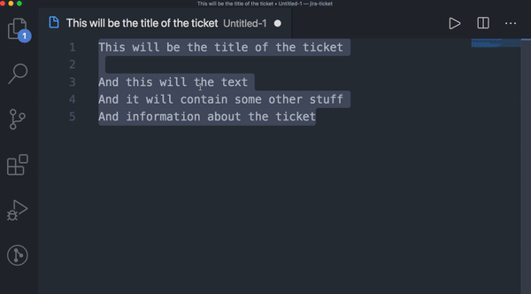

Jira Ticket Creator
===================

Create Jira tickets straight from the command line.



## Installation
Head to the [releases page](https://github.com/rickschubert/jira-ticket/releases/latest) and download the binary. You probably still have to make it executable using `chmod +x`, i.e. `chmod +x jira-ticket_v1.2.3`.

## Setup
- Copy the file [.jiraticketcreator](https://github.com/rickschubert/jira-ticket/blob/master/.jiraticketcreator) into your home directory (`~`). Fill in your Jira user name, user ID, API Key and base URL. You can find out [how to create an API Key here](https://confluence.atlassian.com/cloud/api-tokens-938839638.html). You can see your user ID if you set yourself as a reporter of an issue in Jira and then inspect the network request that has been made.

# Creating a new ticket
* Option A: Run `./jira-ticket [shortcut]` to parse a complete Jira ticket *from your clipboard*, which assumes the following format:

```
First line of clipboard content becomes title of the ticket
Everything after first line becomes description of the ticket
    which can also include line breaks
    and tabs and spaces etc., however you like it
```

* Option B: Run `./jira-ticket [shortcut] "[title of your ticket]" "[description of your ticket]"` (Ticket description is optional)

What shortcuts you can use is determined by the `SHORTCUTS` section in your `~/.jiraticketcreator` file. The example below means that `./jira-ticket green` would create an issue of type "98002" against the Jira board "10001". Additionally, the newly created ticket would carry the label "Frontend" and be automatically assigned to the person with user id "5b9f82a2f226b393480f271a". Since the configuration is just JSON, you can create shortcuts however you like! (For a list of tray specific configurations, please ping me privately.)

Required fields: `shortcut`, `id`, `defaultIssueType`

Optional fields: `labels`, `assignee`

```json
{
    "shortcut": "green",
    "id": "10001",
    "defaultIssueType": "98002",
    "labels": ["Frontend"],
    "assignee": "5b9f82a2f226b393480f271a"
}
```

## Flags
- `--self-assign`, `--self` or `-s`: assigns the created Jira ticket to yourself
- `--sdet-bot`: Create a tray known issue notification for that new Jira ticket

# Development
- `go get` gets all dependencies, using go modules
- Run all the tests with `make test`
- Create a new release version with `make release` (requires that you set a new `git tag` before)
- `go install` will create the executable inside `$GOPATH/bin`
- `go build` will build the tool into the directory of the repository

## For tray SDETs only
There is an optional flag called `--sdet-bot` which will turn your issue into a notification for the SDET Known Issue Bot. In order to do so, the ticket title *or* description need to contain the name of the failing feature, exactly spelled as the feature name (i.e. `historyRollback2`).

If you want to use this option, please add to the settings file these properties:
* `FEATURE_FOLDER` to reflect where on your machine the features are
* `KNOWN_ISSUE_WORKFLOW_URL` which is the URL of the webhook workflow to trigger notifications (you can ping me in private for this)
